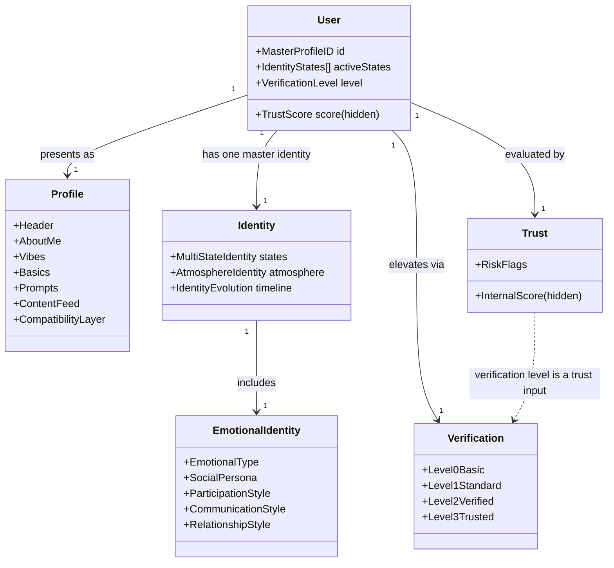
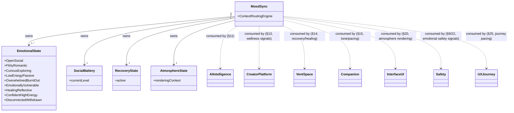

# TruLura Domain Model — v1

*The canonical description of TruLura's core business entities and their relationships. Every statement is grounded in the Blueprint (`docs/02-Product/TruLura_Blueprint.md.md`, cited by section), the Product Decisions Register, the Engineering Gap Register, the Dependency Graph, the Constitution set, or the current Flutter repository. Nothing below is an invented feature. Where information does not exist in any source, this document says "Not Yet Defined" rather than filling the gap. Terminology is preserved exactly as the Blueprint uses it, including two internally inconsistent names (Spark/Sync, per PD-08) that this document does not resolve on Product's behalf.*

## How to Read This Document

Each domain object is documented against the same twelve fields: Purpose, Owner, Responsibilities, Data It Owns, Data It Consumes, Relationships, Lifecycle, Permissions, AI Interactions, Events Emitted, Events Consumed, Backend Dependencies, UI Dependencies. A field reads "Not Yet Defined" when no source document specifies it — this is common for Lifecycle, Events, and Permissions fields, since the Blueprint documents *what* systems own and *why*, not yet the operational mechanics of state transitions or event payloads (see Engineering Gap EG-14: state-change propagation is described conceptually but not specified as an implementable event system).

Domain objects are grouped into six clusters for readability, each opening with a Mermaid diagram. This groups Blueprint-adjacent concepts (e.g., Emotional Identity vs. Emotional State) next to each other specifically so their distinction is visible rather than lost.

---

## Cluster 1 — Identity, Trust & Verification



### User

- **Purpose:** The single continuous entity every other domain object attaches to. "Each user has one master identity" (§1.1).
- **Owner:** Section 1 (Identity & Trust System) — `Master Profile ID (global identity anchor)` (§1.1).
- **Responsibilities:** Anchors identity continuity across modes, environments, and identity states.
- **Data it owns:** Master Profile ID, active Identity States, current Verification Level, hidden Trust Score.
- **Data it consumes:** Not Yet Defined at the User level specifically — consumption is delegated to Profile, Identity, Trust, and Verification below.
- **Relationships:** One-to-one with Profile, Identity, Trust, Verification. See diagram above.
- **Lifecycle:** Not Yet Defined — the Blueprint describes identity state *transitions* (§1.1.1: direct user action, system-triggered conditions, eligibility checks, state persistence) but not a full account lifecycle (creation, deactivation, deletion).
- **Permissions:** Certain features require "identity elevation" — dating access, payments/monetization, private or high-trust interactions (§1.1). Anonymous identity cannot access payments, monetization tools, or certain private interactions (§1.1.1).
- **AI interactions:** Not Yet Defined at the User level — see Identity, Trust, MoodSync below for the AI-consuming sub-systems.
- **Events emitted:** Not Yet Defined (see EG-14, state-change propagation is conceptual, not specified as an event system).
- **Events consumed:** Not Yet Defined.
- **Backend dependencies:** Repository `profiles` table (Architecture Map §04); Blueprint schema itself is Not Yet Defined (Engineering Gap EG-03: "no field-level schema; Master Profile ID has no defined data model").
- **UI dependencies:** `lib/models/user.dart`, `lib/providers/app_provider.dart` (repository code, current implementation — see Blueprint-to-Code Matrix §1).

### Identity

- **Purpose:** Governs how one user exists differently across contexts without fragmenting (§1.1).
- **Owner:** Section 1.1 (Identity Core System), with sub-systems 1.1.1 (State Transition Logic), 1.1.3 (Evolution System), 1.1.4 (Multi-State Identity System), 1.1.5 (Atmosphere Identity System).
- **Responsibilities:** Identity Layer Switching, Anonymous Overlay, state transition eligibility checks, identity evolution tracking, atmosphere-based routing.
- **Data it owns:** Identity States (Social, Relationship, Creator, Community, Anonymous, Healing, Travel, Luxe — §1.1.4), Atmosphere variables (energy level, social intensity, communication style, emotional warmth, community preference, creative expression preference, recovery preference, discovery preference — §1.1.5), Identity Evolution timeline.
- **Data it consumes:** Verification level, Trust score thresholds, and privacy settings, to evaluate state-transition eligibility (§1.1.1).
- **Relationships:** Contains Emotional Identity as a sub-component (§1.1.2). Feeds Discovery routing, Community suggestions, Feed personalization, Event suggestions (§1.1.5 System Outputs).
- **Lifecycle:** State transitions occur via direct user action or system-triggered conditions, gated by eligibility checks; the system remembers the last valid state; sensitive states may require revalidation (§1.1.1).
- **Permissions:** Anonymous state explicitly restricted from payments, monetization, and certain private interactions (§1.1.1).
- **AI interactions:** Not Yet Defined directly — Identity Evolution's inputs (quiz outcomes, interest changes) suggest AI-adjacent personalization, but no Blueprint text names an AI consumer of Identity specifically (distinct from Emotional Identity, which explicitly feeds AI personalization — see below).
- **Events emitted / consumed:** Not Yet Defined.
- **Backend dependencies:** Not Yet Defined (EG-03, same schema gap as User).
- **UI dependencies:** `lib/services/identity_service.dart`, `lib/services/identity_profile_service.dart` — current repository implementation is fragmented across two services with no single source of truth (Technical Debt TD-01; see also the Product Constitution's "Identity Is Singular and Contextual, Not Fragmented" and Guiding Principle 3).

### Emotional Identity

*Deliberately distinguished from Emotional State (Cluster 2) — this is a slower-changing trait profile, not the real-time MoodSync model. Conflating the two would misrepresent the Blueprint.*

- **Purpose:** "Emotional identity plays a significant role in compatibility, belonging, communication, and community participation" (§1.1.2) — a deeper identity layer beyond demographics/interests.
- **Owner:** Section 1.1.2 (Emotional Identity Infrastructure), part of Section 1's Identity Core, **not** Section 12 MoodSync.
- **Responsibilities:** Classifies stable emotional/behavioral traits, not moment-to-moment state.
- **Data it owns:** Emotional Type, Social Persona, Participation Style, Emotional Energy Indicators, Communication Style, Relationship Style, Creator Expression Profile, Community Participation Profile (§1.1.2, "Core Components").
- **Data it consumes:** Not specified as consuming external data — it's an interpreted profile.
- **Relationships:** Influences Discovery recommendations, Community suggestions, Compatibility systems, Atmosphere matching, Creator recommendations, Participation experiences, AI personalization systems (§1.1.2, "System Behavior").
- **Lifecycle:** Not Yet Defined.
- **Permissions:** Not Yet Defined — explicitly not used to gate/limit users: "Emotional identity is not used to limit users. It exists to improve self-expression, compatibility, belonging, and participation quality" (§1.1.2, Core Principle).
- **AI interactions:** Explicitly named as an AI personalization input (§1.1.2).
- **Events emitted / consumed:** Not Yet Defined.
- **Backend dependencies:** Not Yet Defined.
- **UI dependencies:** Not Yet Defined — no current repository code distinctly separates Emotional Identity from Trust/Mood fields on `User` (Architecture Map §07 notes `User` carries `vibeLabel`, mood tags, etc. without a formal Emotional Identity vs. Emotional State split).

### Trust

- **Purpose:** "A safety intelligence layer," not a social ranking system (§1.3).
- **Owner:** Section 1.3 (Trust & Behavior Scoring System — canonical definition; Sections 9.22 and 22.18 consume rather than redefine it, per the Blueprint's own inline note).
- **Responsibilities:** Evaluates behavior to maintain safety and platform integrity; governs access, visibility, discovery quality, and participation opportunities platform-wide (§1.3.1).
- **Data it owns:** Internal trust score (hidden by default), risk flag system.
- **Data it consumes:** Message behavior patterns, report history, block frequency, ghosting/inconsistency patterns, response behavior, verification level (§1.3, "Input Signals").
- **Relationships:** Consumed by Feature access control and Match filtering (§1.3). Section 9 (Safety) owns "Trust enforcement" as a distinct function (§9, "Section 9 owns").
- **Lifecycle:** Score increases through verified identity, positive interaction patterns, consistent behavior; decreases through reports/violations, blocking patterns, abusive communication (§1.3, "Backend Logic").
- **Permissions:** "Not publicly visible by default. Only selected indicators may be shown if the user chooses" (§1.3, Core Rule).
- **AI interactions:** Not Yet Defined directly in Section 1.3's text, though Trust is one of the four inputs to the cross-cutting Permission Resolution formula that AI-adjacent systems consume (Engineering Gap EG-01).
- **Events emitted / consumed:** Not Yet Defined.
- **Backend dependencies:** No numeric scale, per-signal weights, or feature-gating thresholds are defined (Engineering Gap EG-02) — the *model* exists in the Blueprint, the *parameters* do not.
- **UI dependencies:** `lib/services/trust_score_service.dart` (repository code exists but has zero call sites — Technical Debt TD-10, explicitly protected from changes without approval), `lib/services/trust_signal_service.dart`.

### Verification

- **Purpose:** "Controls how users prove identity and unlock higher-trust features... progressive, optional at entry, but required for deeper access" (§1.2).
- **Owner:** Section 1.2 (Verification Layers System).
- **Responsibilities:** Defines the 4-level progressive verification ladder and what each level unlocks.
- **Data it owns:** Verification Level (0–3), per-level unlock state.
- **Data it consumes:** Not Yet Defined (external verification inputs — e.g. a specific ID-verification vendor — are Not Yet Defined pending PD-19).
- **Relationships:** Feeds Trust as an input signal (§1.3). Gates Identity state transitions requiring elevation (§1.1.1).
- **Lifecycle:** Level 0 (Basic: email/phone) → Level 1 (Standard: selfie, unlocks messaging) → Level 2 (Verified: government ID, unlocks dating/monetization) → Level 3 (Trusted: optional background check, high-trust badge) — §1.2.
- **Permissions:** Higher verification increases trust weighting; users control which verification elements are visible (§1.2).
- **AI interactions:** Not Yet Defined.
- **Events emitted / consumed:** Not Yet Defined.
- **Backend dependencies:** No permission matrix mapping each level to every gated feature exists yet — only one example per level is given in the Blueprint (Engineering Gap EG-07). Payment/identity-verification vendor is unselected (PD-19).
- **UI dependencies:** Not Yet Defined in the current repository — no dedicated Verification Center/Progress Tracker UI found in `lib/` (Blueprint-to-Code Matrix §1 marks Section 1 overall "Partial").

**Note on naming:** the Product Decisions Register (PD-01) flags that this Level 0–3 scale, Section 2.1.2's tier scheme, and Section 9.2.1/9.2.2's scheme may be one system under three names — this document uses Section 1.2's scale as primary per the register's own recommendation, but treats the equivalence as unconfirmed.

---

## Cluster 2 — MoodSync & Emotional State



### MoodSync

- **Purpose:** "A real-time emotional intelligence layer that continuously interprets and responds to user emotional states... transforms Trulura from a reactive platform into a context-aware emotional environment" (§12.1).
- **Owner:** Section 12 (Trulura Mood & Emotional State System) — the Blueprint's highest-fan-out dependency (Dependency Graph: 9+ confirmed consuming sections).
- **Responsibilities:** Emotional signal detection, mood-to-behavior mapping, transparency to the user about personalization, strict ethical boundaries.
- **Data it owns:** "Emotional States, Emotional Readiness, Social Battery, Atmosphere States, Recovery States, Context Routing" (§12.11.1, verbatim ownership list).
- **Data it consumes:** Interaction patterns (scroll speed, engagement depth), message tone/response timing, content engagement type, user-selected mood tags (optional, overrides AI inference), AI-inferred signals from language/behavior analysis (§12.3).
- **Relationships:** See diagram above — consumed by AI (§11), Creator (§13, wellness/burnout signals), Vent Space (§14, recovery/healing), Companion (§15, tone/pacing), Interface (§20, atmosphere rendering), Safety (§22, emotional safety), UX Journey (§25, pacing). None of these consumers own or redefine MoodSync's data (§12.11.1).
- **Lifecycle:** "Each state is dynamic and continuously updated based on behavioral patterns rather than single interactions" (§12.2); the system "avoids reacting to isolated behaviors," "prioritizes consistency over time," and "recalibrates gradually" (§12.3).
- **Permissions:** Users can review, modify, or disable supported MoodSync personalization settings (§12.10.1, Transparency Layer).
- **AI interactions:** Section 11 (AI Intelligence) "consumes emotional intelligence signals generated by MoodSync but does not own or define those systems" (§11.14.1) — a strict one-directional consumption relationship.
- **Events emitted:** Not formally specified as an event system, though the Context Routing Engine is described as "the operational core of the MoodSync system" (Blueprint, MoodSync section) — Engineering Gap EG-05 confirms no defined signal set, detection confidence thresholds, or Social Battery numeric model exists yet.
- **Events consumed:** Behavioral/interaction signals per §12.3 above.
- **Backend dependencies:** Not Yet Defined — EG-05 is Critical priority precisely because MoodSync's own signal model isn't specified numerically yet, despite being the highest-fan-out system in the product.
- **UI dependencies:** In the current repository, fragmented into two unsynced systems — `AppProvider.emotionalPresenceState` and `AuraController.state` — that can visibly disagree on the same screen (Technical Debt TD-02; this directly violates Guiding Principle 5, "MoodSync is the one emotional source of truth").

### Emotional State

- **Purpose:** The dynamic, moment-to-moment classification MoodSync produces (§12.2).
- **Owner:** Section 12, sub-owned data of MoodSync (not a separate system).
- **Responsibilities:** Nine primary states, each with defined system behavior: Open/Social, Flirty/Romantic, Curious/Exploring, Low Energy/Passive, Overwhelmed/Burnt Out, Emotionally Vulnerable, Healing/Reflective, Confident/High Energy, Disconnected/Withdrawn (§12.2).
- **Data it owns:** The current state classification itself.
- **Data it consumes:** See MoodSync's "Data it consumes" above — Emotional State is MoodSync's primary output, not an independently-fed entity.
- **Relationships:** Drives Mood → System Behavior Mapping (§12.4) — e.g. Low Energy/Passive slows feed pacing and limits notifications; Flirty/Romantic increases Spark exposure; Overwhelmed activates Soft Mode automatically.
- **Lifecycle:** Continuously re-evaluated, not event-triggered on isolated actions (§12.3).
- **Permissions:** Not Yet Defined beyond MoodSync's general transparency controls.
- **AI interactions:** Directly interpreted by Section 11 AI Intelligence (§11.2.3, MoodSync Intelligence Layer).
- **Events emitted / consumed:** Not Yet Defined at the individual-state level.
- **Backend dependencies:** Not Yet Defined (EG-05).
- **UI dependencies:** `lib/models/emotional_presence_state.dart` (`TruEmotionalPresenceState`, ~13 numeric fields — motion/glow/intensity/warmth) — Architecture Map §07 confirms this is the repository's closest analog, though it does not map 1:1 onto the Blueprint's 9 named states.

### Social Battery

- **Purpose:** Not independently defined beyond its listing — owned by MoodSync as one of six core data types (§12.11.1).
- **Owner:** Section 12 (MoodSync).
- **Responsibilities:** Not Yet Defined beyond ownership — the Blueprint names Social Battery but does not give it a dedicated subsection with its own behavior mapping (distinct from the Low Energy/Passive Emotional State, which is the closest specified analog).
- **Data it owns / consumes / Relationships / Lifecycle / Permissions / AI interactions / Events / Backend / UI dependencies:** Not Yet Defined — flagged rather than invented. EG-05 (MoodSync signal set, including "Social Battery numeric model") confirms this is a known, logged gap, not an oversight in this document.

### Recovery State

- **Purpose:** Supports users in healing, burnout recovery, or emotional processing.
- **Owner:** Section 12 (MoodSync) owns Recovery States as data; Section 14 (Vent Space) explicitly does **not** own Recovery States, only consumes them for Healing Pathways and Recovery Support (§14, "Section 14 does not own").
- **Responsibilities:** Not Yet Defined beyond the ownership boundary above.
- **Data it owns:** Recovery State classification (owned by §12).
- **Data it consumes:** Not Yet Defined.
- **Relationships:** Consumed by Vent Space (§14) for Healing Pathways, Healing Circles, Reintegration Support, Recovery Recognition.
- **Lifecycle:** Not Yet Defined — §25's Journey system references "Returning from burnout," "Completing recovery goals," and "Recovery milestones should celebrate progress without creating pressure" (§25), but no formal state machine is specified.
- **Permissions, AI interactions, Events, Backend, UI dependencies:** Not Yet Defined.

---

## Cluster 3 — Interaction Signals & Discovery

```mermaid
flowchart LR
    Aura["Aura — identity/energy signal (§6.13) &<br/>Discovery environment (§4 title)"]
    Glow["Glow — safe/friendly signal (§6.13)"]
    Spark["Spark — romantic intent signal (§6.13) /<br/>Matchmaking system (§6)"]
    Discovery["Discovery / Feed (§4)<br/>owns: ranking, algorithms, distribution,<br/>visibility, recommendations"]
    Sync["\"Sync\" — code implementation,<br/>naming conflict with Spark (PD-08)"]

    Aura -- "identity signal shapes" --> Discovery
    Glow -- "friendly engagement, esp. youth/friendship spaces" --> Discovery
    Spark -- "romantic intent, feeds" --> Discovery
    Spark -. "possibly same system, unconfirmed" .-> Sync
```

### Aura

- **Purpose:** Two distinct, related Blueprint usages — (1) the Discovery/Social Feed environment, "Aura (Social Feed / Identity Layer)" (§10.9.1); (2) a broader identity/interaction signal, functioning "as a broader identity signal that influences how a user is perceived across the platform, shaping visibility, energy, and contextual interpretation" (§6.13).
- **Owner:** Section 4 (as environment) / Section 6.13 (as signal) — the Blueprint does not merge these into one owning section.
- **Responsibilities:** As environment: primary feed surface. As signal: contextual perception marker.
- **Data it owns:** Not Yet Defined precisely — the signal's underlying data model is not specified beyond its descriptive role.
- **Data it consumes:** As environment, consumes Discovery's ranking/recommendation outputs.
- **Relationships:** Named alongside Spark and Glow as one of three primary interaction signals in the "Spark, Glow & Aura Interaction Engine" (§6.13).
- **Lifecycle, Permissions, AI interactions, Events, Backend dependencies:** Not Yet Defined.
- **UI dependencies:** `lib/screens/home/home_feed_screen.dart` (the "Aura" tab in the current repository, per the Architecture Map).

### Glow

- **Purpose:** "Safe, friendly, or non-romantic engagement... especially important in youth spaces, friendship discovery, and community-based interaction" (§6.13).
- **Owner:** Section 6.13.
- **Responsibilities, Data owned/consumed, Lifecycle, Permissions, AI interactions, Events, Backend/UI dependencies:** Not Yet Defined beyond the descriptive role above — no dedicated Glow subsection with its own data model exists in the Blueprint text found so far.
- **Relationships:** One of three interaction signals alongside Spark and Aura (§6.13).

### Spark

- **Purpose:** "Romantic or connection-oriented intent... used when a user is expressing interest in exploring a deeper or potentially romantic interaction" (§6.13); also the title of Section 6, "Matchmaking System, Attraction Logic & Guided Connection Architecture."
- **Owner:** Section 6.
- **Responsibilities:** Guided connection progression, effort-gated escalation, attraction/compatibility evaluation.
- **Data it owns:** Not fully specified — Engineering Gap EG-13 confirms "no schema for Connection object, stage history."
- **Data it consumes:** Compatibility/attraction signals (Profile's Compatibility Layer, §5.1).
- **Relationships:** **Naming conflict, unresolved (PD-08):** Section 10.8/10.9.1 uses "Sync (Matchmaking / Dating Mode)" for what appears to be this same system. This document does not resolve which label is canonical.
- **Lifecycle:** Effort-Gated Escalation System governs progression from initial contact to deeper connection (§6.3) — no numeric scoring formula defined yet (EG-09).
- **Permissions:** Requires Romantic Connection Mode to be explicitly entered — "not the default" (§2, referencing Romantic Connection Mode).
- **AI interactions:** AI Intelligence extends into "the interaction layer itself — supporting how users connect, not just what they see" (§4, contrasted with traditional platforms) — Spark/matchmaking is a named beneficiary of this AI extension.
- **Events emitted / consumed:** Not Yet Defined.
- **Backend dependencies:** No Connection/Match schema (EG-13); no effort-scoring formula (EG-09).
- **UI dependencies:** `lib/screens/sync/sync_screen.dart`, `lib/services/sync_service/sync_service.dart` (local-only, no Supabase backing — Technical Debt TD-05; Blueprint-to-Code Matrix §6 marks this "Partial — as 'Sync'").

### Discovery / Feed

- **Purpose:** "Ensures that every recommendation aligns with user intent, emotional state, and platform integrity" (§4.1, Discovery Philosophy).
- **Owner:** Section 4.
- **Responsibilities:** Feed ranking, discovery algorithms, content distribution, visibility optimization, recommendation systems (§4, "Section 4 owns," verbatim).
- **Data it owns:** Content object, Tag taxonomy, Ranking signals (Implementation Roadmap, §4 row).
- **Data it consumes:** Mode/participation context and visibility permissions from Section 2 (§2.3, "Section 2 influences Discovery"); Emotional Identity and Atmosphere Identity outputs (§1.1.2, §1.1.5); MoodSync's emotional state (§12.1, "This system influences: Discovery and feed behavior").
- **Relationships:** Governed by a layer above raw ranking — "even high-performing content cannot gain visibility if it violates safety, emotional, or behavioral standards" (§4, Feed Intelligence governing layer).
- **Lifecycle:** Not Yet Defined as a formal state machine — content moves through ranking continuously, not via discrete lifecycle stages specified in the Blueprint.
- **Permissions:** Mode-gated — different tabs/environments (Aura, Sync, Vent, Trending) apply different rules (§10.11.1).
- **AI interactions:** AI Intelligence consumes Discovery's ranking signals for personalization (Dependency Graph, "AI Intelligence → Feed ranking signals").
- **Events emitted / consumed:** Not Yet Defined.
- **Backend dependencies:** No Layer Priority Rule precedence values or scoring formula exist yet — "blocks the entire 6-layer feed architecture" (Engineering Gap EG-04, Critical).
- **UI dependencies:** `lib/screens/home/home_feed_screen.dart`, `lib/services/feed_distribution_engine.dart`, `lib/services/visibility_service.dart` — the repository's `FeedDistributionEngine` is a real ranking algorithm already built, worth reviewing as a candidate answer to EG-04 rather than treating the gap as unfilled (Blueprint-to-Code Matrix §01, finding under §4).

---

## Cluster 4 — Support & Creator Systems

```mermaid
classDiagram
    class Companion {
        +behavior
        +tone
        +memory
        +supportRouting
        +userControls
        +relationshipGuidance
    }
    class VentSpace {
        +HealingPathways
        +ReflectionSystems
        +HealingCircles
    }
    class Creator {
        +CreatorIdentity
        +CreatorTools
        +CreatorWellness
        +CreatorProgression
    }
    class Community {
        +InterestBasedSpaces
        +IdentityBasedSpaces
        +EmotionalSupportSpaces
    }
    MoodSync ..> Companion : tone, pacing, guidance
    MoodSync ..> VentSpace : recovery, healing signals
    MoodSync ..> Creator : wellness, burnout signals
    AIIntelligence ..> Companion : core intelligence (not owned by Companion)
    VentSpace ..> Community : Emotional & Support Spaces overlap
    Creator ..> Monetization : "Section 7 owns revenue; §13 owns creator identity/tools"
```

### Companion

- **Purpose:** "A personalized, adaptive intelligence layer designed to support users emotionally, socially, and relationally... not task-focused — it is emotionally aware, behaviorally adaptive, and context-driven" (§15.1).
- **Owner:** Section 15.
- **Responsibilities:** Reflective support, relationship/interaction guidance, behavioral pattern interpretation, soft safety intervention (§15.1).
- **Data it owns:** "AI Companion behavior, Companion tone, Companion memory, Companion support routing, Companion user controls, Companion relationship guidance" (§15, "Section 15 owns," verbatim).
- **Data it consumes:** MoodSync signals for tone/pacing/guidance adaptation (§12.11.1).
- **Relationships:** Explicitly does **not** own "Core AI infrastructure, Mood states, Clinical support, Interface rendering, Journey routing" (§15, "Section 15 does not own") — it consumes these from Sections 11, 12, 20, 25 respectively.
- **Lifecycle:** Not Yet Defined — no retention period, storage scope, or deletion mechanism for Companion memory exists yet (Engineering Gap EG-15, privacy-sensitive).
- **Permissions:** "Support, Not Control — the AI suggests and guides, it does not direct or override user decisions" (§15.2).
- **AI interactions:** Is itself an AI-driven system, built on "human-aligned interaction principles, not automation efficiency" (§15.2); "does not replace human relationships" (AI Constitution, citing §15.4).
- **Events emitted / consumed:** Not Yet Defined.
- **Backend dependencies:** Not Yet Defined — no schema exists; blocked on PD-11 (proposed: non-memory baseline is Core Beta, persistent memory is Phase 2 — not yet confirmed) and EG-15.
- **UI dependencies:** `lib/screens/ai/ai_companion_screen.dart` — currently fully ephemeral `StatefulWidget` state, no persistence at all (Technical Debt TD-12).

### Vent Space

- **Purpose:** "A protected emotional environment... where users can express thoughts, feelings, and experiences without the pressure of performance, visibility, or monetization" (§14.1).
- **Owner:** Section 14.
- **Responsibilities:** "Vent Space, Healing Pathways, Recovery Support, Healing Circles, Reflection Systems, Reintegration Support, Recovery Recognition" (§14, "Section 14 owns," verbatim).
- **Data it owns:** Vent posts/sessions (privacy-sensitive — Implementation Roadmap, §14 row).
- **Data it consumes:** Recovery States and MoodSync Intelligence, which it explicitly does **not** own (§14, "Section 14 does not own").
- **Relationships:** "Excluded from Monetization systems, Algorithmic amplification, Performance-based visibility ranking" (§14 intro) — the most isolated system in the Blueprint by design.
- **Lifecycle:** Not Yet Defined beyond posting/expression types (text, guided prompts, voice, anonymous — §14.3).
- **Permissions:** Users control visibility per post (private, limited, or community-based — §14.2).
- **AI interactions:** "Supported by the AI system but does not replace human connection" (§14.14, AI Constitution).
- **Events emitted / consumed:** Not Yet Defined.
- **Backend dependencies:** Crisis-detection mechanism referenced identically here and in Sections 9/15 with no shared owner defined yet (Engineering Gap EG-06/PD-12, Critical — needs Trust & Safety input, not an engineering guess).
- **UI dependencies:** `lib/screens/vent/vent_screen.dart`, `lib/services/feed_demo_content_service.dart`, `lib/services/visibility_service.dart` (real isolation logic already exists — Blueprint-to-Code Matrix §14 marks this "Exists").

### Creator

- **Purpose:** "A structured ecosystem that allows users to create, distribute, and monetize content while maintaining alignment with Trulura's emotional, social, and safety-first architecture" (§13.1). TruStudio is its dashboard.
- **Owner:** Section 13.
- **Responsibilities:** "Creator Identity, Creator Tools, Creator Wellness, Creator Growth, Creator Communities, Creator Trust, Creator Sustainability, Creator Progression" (§13, "Section 13 owns," verbatim).
- **Data it owns:** Creator role/archetype (Lifestyle, Emotional, Entertainment, Educational, Premium/Experience creators — §13.2), Creator Wellness Dashboard signals (participation load, audience pressure, burnout indicators, posting pace — §13.3.1).
- **Data it consumes:** Monetization structure from Section 7 for "transparent revenue splits, consistent payout logic" (§13.1) — Creator does not own revenue mechanics, only creator-side identity/tools/wellness.
- **Relationships:** Uses MoodSync's creator wellness/burnout signals (§12.11.1).
- **Lifecycle:** Any user can evolve into a creator through participation, "without needing to meet follower thresholds" (§7.1) — no gated onboarding step is specified.
- **Permissions:** Not Yet Defined precisely — gated by Experience Mode (Creator Mode) per Section 2's mode-permission model.
- **AI interactions:** Not directly specified beyond wellness-signal consumption from MoodSync.
- **Events emitted / consumed:** Not Yet Defined.
- **Backend dependencies:** No Wallet/Transaction/Payout schema exists (Engineering Gap EG-12); progression criteria for Creator's stage names (Emerging→Ambassador, per the Project Completion Summary's canonical merge) are the one remaining piece of the otherwise-resolved EG-11.
- **UI dependencies:** `lib/screens/trustudio/trustudio_screen.dart` — a full 6-tab UI shell exists (Dashboard/Live Tools/Subscribers/Brand Deals/Content/Payouts) with real `AppProvider` gating flags, but zero Supabase tables back it (Blueprint-to-Code Matrix §13, "Placeholder"). The Beta Readiness Checklist confirms the early-monetization slice specifically as Core Beta.

### Community

- **Purpose:** "The community backbone of Trulura, enabling users to move beyond individual interaction into shared environments... users don't just 'use' the platform — they belong within it" (§19.11).
- **Owner:** Section 19.11–19.23 (Social Ecosystem) — canonical merge target for what Section 4.18 originally called Community layers (Project Completion Summary).
- **Responsibilities:** Structures Spaces by type and governs how users move between them.
- **Data it owns:** Space, Space Membership, Space Role (no schema defined yet — Engineering Gap EG-23).
- **Data it consumes:** Not Yet Defined precisely beyond identity/interest signals implied by space categorization.
- **Relationships:** Three Space types named: Interest-Based (Gaming/Anime, Music/Fandom, Fitness/Health, Travel), Identity-Based (Mommy Space, LGBTQ+, Cultural Communities, Faith-Based Spaces — "higher moderation sensitivity"), and Emotional & Support Spaces (§19.12, partially read — the third category's full definition is Not Yet Defined in the portion of the Blueprint reviewed for this document).
- **Lifecycle:** "Communities evolve based on behavior... users move fluidly between spaces" (§19.11).
- **Permissions:** No defined per-role permission set exists yet (Engineering Gap EG-23, shares the permission-matrix dependency with EG-01/EG-07).
- **AI interactions:** Not Yet Defined precisely.
- **Events emitted / consumed:** Not Yet Defined.
- **Backend dependencies:** No Space/Membership/Role schema (EG-23).
- **UI dependencies:** Not Yet Defined — no Community/Spaces code found anywhere in `lib/` (Blueprint-to-Code Matrix §19, "Missing").

---

## Cluster 5 — Communication & Signals

### Messaging

- **Purpose:** Not a standalone named Blueprint system. "Permission-Based Messaging System — users are not universally reachable" appears as one feature within Section 6's Communication Permission Logic (§6, "Core Communication Logic Features").
- **Owner:** Section 6 (Matchmaking), as a sub-feature — not independently owned by any section.
- **Responsibilities:** Multi-factor communication evaluation, mode-aware communication rules, user-controlled boundaries (§6).
- **Data it owns / consumes / Relationships / Lifecycle / Permissions / AI interactions / Events / Backend dependencies:** Not Yet Defined — the Blueprint does not give Messaging its own data model, and Engineering Question EQ-01 (`docs/04-Engineering/TruLura_Engineering-Governance.md` §02) explicitly logs this as an open question: is post-match messaging fully covered under Section 6, or is this a genuine Blueprint gap?
- **UI dependencies:** `lib/screens/chat/chat_list_screen.dart`, `lib/screens/chat/chat_thread_screen.dart`, `lib/services/chat_service.dart` — entirely local, hardcoded seed data, no Supabase backing (Technical Debt TD-05).

### Notifications

- **Purpose:** Referenced in Section 10.13 as a navigation/UI concern; no dedicated ownership section exists.
- **Owner:** Section 10.13 (Notification System), within Platform Navigation & UI System.
- **Responsibilities:** Not Yet Defined beyond a types list.
- **Data it owns:** Notification type taxonomy (types are listed in §10.13.1, not reproduced here since the full list wasn't part of this document's verified reads — cite `docs/02-Product/TruLura_Blueprint.md.md` line 12569 directly for the exact list).
- **Data it consumes:** Not Yet Defined.
- **Relationships:** Not Yet Defined.
- **Lifecycle, Permissions, AI interactions, Events:** Not Yet Defined.
- **Backend dependencies:** "Types listed, no delivery-channel or frequency-cap specification" (Engineering Gap EG-18, Medium priority).
- **UI dependencies:** `lib/screens/notifications/notifications_screen.dart` — entirely hardcoded demo data (`_NotificationDemo`), no model, service, provider, or table (Technical Debt TD-06).

### Events (Orchestration Trigger System)

*Distinguished from "Events/Live Hub," a secondary-navigation item named once (§10.9.2) with no further specification found — that usage is Not Yet Defined separately from the trigger system below.*

- **Purpose:** The platform's internal event-driven architecture — "Trulura operates on an event-driven system" (§19.2).
- **Owner:** Section 19.2 (Event-Driven Architecture & Trigger System), within Orchestration.
- **Responsibilities:** Defines trigger types that other systems react to.
- **Data it owns:** Event Types — "App Open/Session Start, Mode Switching, Content Interaction, Messaging Activity, Quiz Completion, Safety Signals" (§19.2.1, verbatim).
- **Data it consumes:** State changes from every system that emits a listed trigger type.
- **Relationships:** Sits under the Orchestration hierarchy — "Safety & Consent Systems (Highest Priority) → State & Mode Logic → AI Interpretation Layer → Experience Systems" (§19.1.1) — no event may cause a lower-priority system to override a higher one.
- **Lifecycle:** Not Yet Defined as concrete payloads/schemas — EG-14 confirms the Blueprint describes *what* propagates (mood→feed, trust→visibility, mode→discovery) but not *how*, i.e. an event-driven architecture is implied, not formally specified.
- **Permissions, AI interactions:** Not Yet Defined beyond the priority hierarchy above.
- **Events emitted:** The six types listed above.
- **Events consumed:** Not Yet Defined (no consumer-side subscription model specified).
- **Backend dependencies:** Not Yet Defined — no message-bus/pub-sub implementation named (EG-05 also calls for an "Event Flow" artifact for MoodSync specifically).
- **UI dependencies:** Not Yet Defined — no event-bus code found in `lib/` (Architecture Map notes no `.stream()`/Supabase Realtime usage anywhere in the repository).

---

## Cluster 6 — Phase 2 & Platform-Wide Systems

### TruTravel

- **Purpose:** "Trulura's real-world extension layer, designed to transform digital connections into safe, structured, and meaningful real-life experiences" (§16.1).
- **Owner:** Section 16.
- **Responsibilities:** "Travel Experiences, Real-World Experiences, Travel Matching, Group Travel, Experience Safety, Travel Memories, Experience Continuity" (§16, "Section 16 owns," verbatim).
- **Data it owns:** Experience, Travel Match, Group entities (Implementation Roadmap, §16 row).
- **Data it consumes:** Not Yet Defined precisely, beyond "Connection Before Location" (§16.2) implying it consumes existing Spark/relationship data.
- **Relationships:** Explicitly does **not** own "Mood States, Trust Scores, Interface Rendering, Journey Routing, Creator Monetization" (§16, "Section 16 does not own").
- **Lifecycle, Permissions:** "Safety Before Access — participation depends on eligibility, not just payment" (§16.2). Group-size limits and safety-score threshold are Not Yet Defined pending PD-17 (needs Trust & Safety/Legal input, not an engineering guess).
- **AI interactions, Events:** Not Yet Defined.
- **Backend dependencies:** No group-size cap, safety-score threshold, or per-layer verification criteria defined (Engineering Gap EG-21).
- **UI dependencies:** None — correctly absent from the repository; Phase 2, explicitly out of Core Beta scope (Beta Readiness Checklist).

### TruLuxe

- **Purpose:** "A controlled, high-trust environment... a filtered ecosystem where access, visibility, and interaction are governed by trust, behavior, and alignment," not simply a paid tier (§17.1–17.2).
- **Owner:** Section 17.
- **Responsibilities:** "TruLuxe Access, TruLuxe Qualification, TruLuxe Experiences, TruLuxe Networking, TruLuxe Privacy Controls" (§17, "Section 17 owns," verbatim).
- **Data it owns:** Qualification/tier status.
- **Data it consumes:** Trust, verification, and behavioral data to compute qualification — "even if a user subscribes, they must still meet behavioral, verification, and profile standards" (§17.2).
- **Relationships:** "Qualification Over Payment," "Privacy Over Visibility" (§17.2) — users control their own exposure.
- **Lifecycle, Permissions:** Not Yet Defined precisely — no qualification threshold or layered-reveal sequence exists yet (Engineering Gap EG-22), pending PD-18 (Legal review needed given anti-discrimination/gated-access risk).
- **AI interactions, Events:** Not Yet Defined.
- **Backend dependencies:** No qualification algorithm defined (EG-22).
- **UI dependencies:** None — correctly absent from the repository; Phase 2.

### Monetization

- **Purpose:** "A creator-integrated ecosystem where value is generated through interaction, emotional engagement, content creation, and community participation" — explicitly non-viral (§7.1, §7.1.1).
- **Owner:** Sections 7/8 (merged per the Project Completion Summary's canonical decision).
- **Responsibilities:** "Revenue Systems, Coin Economy, Payout Systems, Revenue Distribution, Subscription Systems, Economic Governance, Financial Safety" (§7, "Section 7 owns," verbatim).
- **Data it owns:** Wallet, Transaction, Payout objects (no schema yet — Engineering Gap EG-12).
- **Data it consumes:** Experience Mode context (Creator Mode enables it, Vent Mode suppresses it, Youth Mode restricts it — §2.5).
- **Relationships:** "Enhances — but does not control — interaction" (Product Constitution, citing §7). Explicitly does not own Mood States (§7, "Section 7 does not own").
- **Lifecycle, Permissions:** Not Yet Defined precisely — coin exchange rate, payout threshold/cadence, exact revenue-split figures, and coin dormancy period are all undefined (Engineering Gap EG-08), pending PD-07 (High priority, financial/compliance risk).
- **AI interactions:** AI "influences when monetization features are presented" but "does not control monetization" (§11.14, AI Constitution).
- **Events emitted / consumed:** Not Yet Defined.
- **Backend dependencies:** EG-08 (financials), EG-12 (schema), PD-19 (payment processor vendor, unselected).
- **UI dependencies:** None found — no wallet/payment/payout code exists anywhere in `lib/` (Blueprint-to-Code Matrix §7/8, "Missing").

### Moderation

- **Purpose:** Proactive, architecture-embedded protection — "Trulura embeds safety directly into its system architecture" rather than reactive moderation (§9.1).
- **Owner:** Section 9 owns "Moderation frameworks" and "Protective interventions" directly (§9, "Section 9 owns," verbatim); Section 24 (Governance) owns the meta-layer — rule framework, enforcement scope, and administrative tooling (admin dashboards, moderation control panels, system override capabilities, real-time intervention tools — §24.3).
- **Responsibilities:** Behavioral evaluation over time (AuraShield: "evaluates behavior over time rather than relying on isolated incidents" — repository code, `services/aura_shield_service.dart`, aligned with §9's philosophy), rule enforcement across users/creators/AI systems/integrations (§24.2.1).
- **Data it owns:** Risk flags, moderation actions, safety flags (Implementation Roadmap, §9 row).
- **Data it consumes:** Trust score, report history, behavioral signals.
- **Relationships:** Section 24's authority composes with Section 19.1.1 (execution sequencing) and Section 22.25 (enforcement ladder) as three distinct, related-not-merged "authority" layers (Dependency Graph, Governance row): "24 sets rules → 19.1.1 sequences execution → 22.25 enforces."
- **Lifecycle:** Section 22.25 provides a 4-stage escalation ladder — Warning → Restriction → Suspension → Ban — that Sections 1.6 and 9.5.4.1 reference rather than redefine (Engineering Gap EG-06 status update).
- **Permissions:** "Platform integrity takes priority over engagement metrics; safety, trust, and fairness override growth shortcuts" (§24.1).
- **AI interactions:** Rules apply explicitly to "AI systems" as a governed actor category, not just users/creators (§24.2.1).
- **Events emitted / consumed:** "Safety Signals" is a named Event Type in the Orchestration trigger system (§19.2.1).
- **Backend dependencies:** Crisis-detection *mechanism* (as opposed to the escalation ladder, which is resolved) remains open pending PD-12 — needs Trust & Safety input, not an engineering guess (Engineering Gap EG-06).
- **UI dependencies:** `lib/services/safety_center_service.dart`, `lib/services/safety_meter_service.dart`, `lib/services/safety_monitoring_service.dart`, `lib/services/aura_shield_service.dart`, `lib/services/reporting_service.dart` — real, local-first implementations exist (Blueprint-to-Code Matrix §9, "Partial"). No admin/moderation panel exists in the repository — the Blueprint itself expects this is "likely a separate app" (`docs/09-Archive` README summary, Section 24).

### AI

- **Purpose:** "The intelligence framework that allows Trulura to function as an adaptive ecosystem rather than a static platform" (§11 intro).
- **Owner:** Section 11 (AI Intelligence, Adaptive Guidance & System Decision Layer).
- **Responsibilities:** Interprets inputs, makes contextual decisions, supports users through responsive real-time guidance — assists, interprets, guides; does not manipulate or replace human judgment (§11 intro, AI Constitution).
- **Data it owns:** Not Yet Defined as a distinct dataset — the AI layer is explicitly a consumer/interpreter, not a data owner: "consumes emotional intelligence signals generated by MoodSync but does not own or define those systems" (§11.14.1).
- **Data it consumes:** MoodSync's emotional signals (§11.2.3), Discovery/feed signals, Compatibility intelligence from Matchmaking, Profile data.
- **Relationships:** See AI Constitution for the full "must never" boundary list (does not control monetization, does not override platform systems, does not replace human connection).
- **Lifecycle:** Not Yet Defined as a formal pipeline.
- **Permissions:** "All AI outputs remain constrained by safety, consent, and user intent" (§11 intro).
- **AI interactions:** N/A (this is the AI system itself).
- **Events emitted / consumed:** Not Yet Defined.
- **Backend dependencies:** Blocked on EG-05 (MoodSync signal set) as its primary upstream dependency.
- **UI dependencies:** `lib/openai/openai_config.dart` — in the current repository, this is a narrow, two-method OpenAI proxy wrapper (reply suggestions, match concierge tips), not the adaptive decision engine the Blueprint describes (Blueprint-to-Code Matrix §11, "Placeholder").

### Analytics

- **Purpose:** Not Yet Defined.
- **Owner:** Not Yet Defined — no section of the Blueprint names an "Analytics" system. A direct search of the full Blueprint text for "Analytics" returns zero matches.
- **Responsibilities, Data it owns, Data it consumes, Relationships, Lifecycle, Permissions, AI interactions, Events emitted, Events consumed, Backend dependencies, UI dependencies:** All Not Yet Defined. This entry is included, per the requested scope, specifically to record that no Blueprint content exists for it — not to invent a system the Product Knowledge System has not specified. If Analytics is intended to exist, it should be raised as a new item for the Product Decisions Register or added to the Blueprint directly, not defined here first.

---

## Cross-References

Every citation above traces to `docs/02-Product/TruLura_Blueprint.md.md` (section numbers), `docs/02-Product/TruLura_Product-Decisions.md.md` (PD-xx), `docs/02-Product/TruLura_Engineering-Gap-Register.md.md` (EG-xx), `docs/02-Product/TruLura_Dependency-Graph.md.md`, `docs/01-Constitution/` (Product Constitution, AI Constitution, Guiding Principles), `docs/03-Architecture/TruLura_Blueprint-to-Code-Matrix.md`, `docs/03-Architecture/TruLura_Architecture-Map.md`, and `docs/04-Engineering/TruLura_Systems_And_Debt_Review.md` (TD-xx) / `TruLura_Engineering-Governance.md` (EQ-xx). This document does not duplicate their content — it synthesizes the domain-object view across all of them.

## Not Yet Defined — Summary

The following are explicitly unresolved by any source document, not omissions of this one: Social Battery's dedicated behavior model; Notifications' delivery/frequency spec; Messaging's independent ownership (vs. Section 6 sub-feature); Events/Live Hub as a UI feature (distinct from the Orchestration trigger system); Community's third Space category detail beyond what was directly read; Analytics entirely; and every backend schema flagged "no schema yet" above (Users/Master Profile, Trust parameters, Connection/Match, Wallet/Transaction/Payout, Space/Membership/Role, Companion memory, Notification).

## Revision Note

This is v1. Per the Documentation Constitution, it should be re-derived from its sources when the Blueprint changes or a cited Product Decision resolves — not hand-edited to drift from them.
